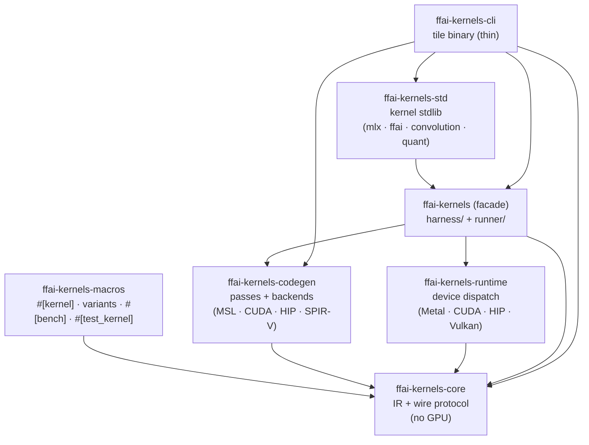
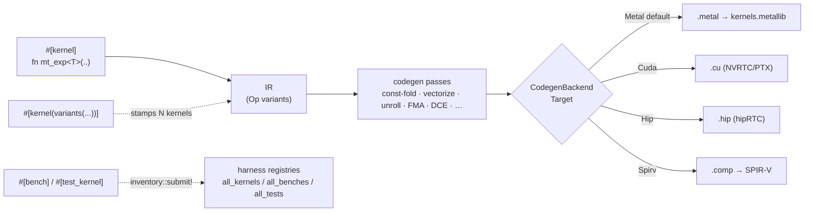
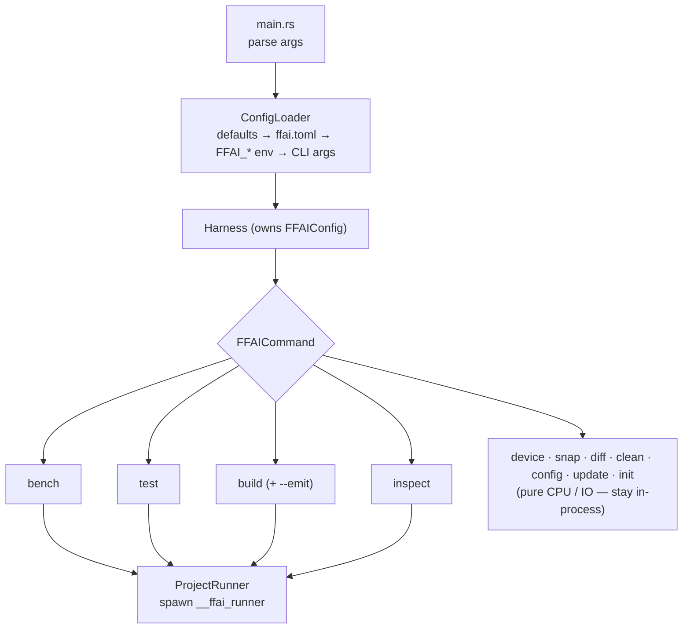
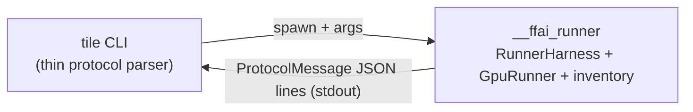
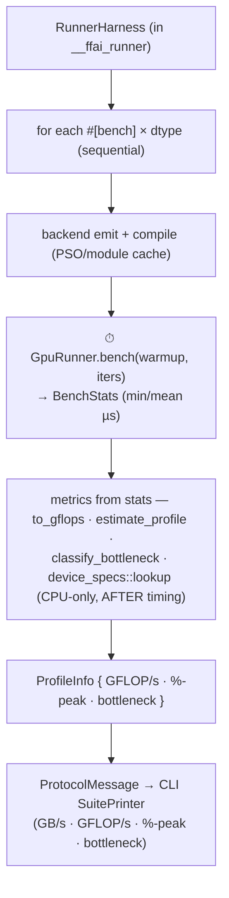
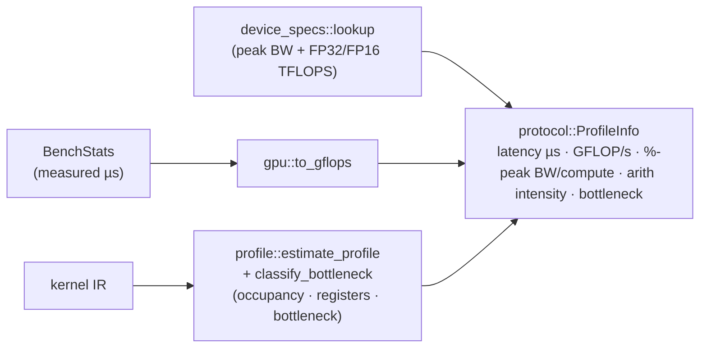

<!--
Copyright 2026 Eric Kryski (@ekryski) and Tom Turney (@TheTom)
SPDX-License-Identifier: Apache-2.0
-->
# FFAI Kernels Architecture

How a `#[kernel]` becomes a compiled GPU shader, and how `ffaik bench` / `ffaik
test` / `ffaik build` run and measure it today. Companion docs:
[`TOOLCHAIN_DESIGN.md`](TOOLCHAIN_DESIGN.md) (the `#[kernel]` /
`#[kernel(variants(...))]` / `#[bench]` / `#[test_kernel]` macro surface),
[`BENCH_METRICS_SPEC.md`](BENCH_METRICS_SPEC.md) (metric definitions),
[`KERNEL_CONSOLIDATION_PLAN.md`](KERNEL_CONSOLIDATION_PLAN.md) (the kernel
restructure roadmap), the backend specs ([`CUDA`](CUDA_BACKEND_SPEC.md) /
[`AMD`](AMD_BACKEND_SPEC.md) / [`VULKAN`](VULKAN_BACKEND_SPEC.md) /
[`ANE`](ANE_BACKEND_SPEC.md)), [`cli.md`](../cli.md) (command flags),
[`developing.md`](../developing.md) (kernel-authoring hazards).

> **Two things drive the current shape of the runtime:**
> 1. **The runner is a subprocess.** `ffaik` spawns a generated `__ffai_runner`
>    binary (linked against the project's `ffai-kernels-std`, so its kernel
>    inventory is populated) and streams results back as `ProtocolMessage`
>    JSON lines — see [Subprocess execution](#subprocess-execution).
> 2. **Codegen is multi-backend.** IR lowers through a `CodegenBackend` to
>    **Metal** (default, mature), **CUDA**, **HIP/ROCm**, or **SPIR-V/Vulkan**.
>    Non-Metal device execution is feature-gated and still being brought up —
>    see [Multi-backend codegen](#multi-backend-codegen).

## Crates

| Crate | Responsibility |
|---|---|
| `ffai-kernels-core` | IR (`Op`, `Kernel`) + the `protocol` wire types (`ProtocolMessage`, `ProfileInfo`). Pure — no GPU, no tooling deps. |
| `ffai-kernels-macros` | `#[kernel]` (lowers a DSL fn to IR) + `#[kernel(variants(...))]` (compile-time specialisation — stamps one kernel per tuple of int/type/float params); `#[bench]` / `#[test_kernel]` (register a setup callback via `inventory`). |
| `ffai-kernels-codegen` | Optimization passes (const-fold, vectorize, unroll, fusion, DCE, …) + the `CodegenBackend` seam: `msl/` (Metal, default) and the `cuda/` / `hip/` / `spirv/` generators. `backend.rs` holds the `Target` enum, `TargetProfile`, and `MmaStrategy`. |
| `ffai-kernels-runtime` | Per-backend device, buffers, PSO/module cache, dispatch + timing. `device/metal_device.rs` is the default; `device/{cuda,hip,vulkan}/` are **feature-gated** (`--features cuda\|hip\|vulkan`). |
| `ffai-kernels` (facade) | Re-exports the above; hosts `harness/` (the kernel/bench/test **registries**) and `runner/` (the `__ffai_runner` engine: `RunnerHarness`, `GpuRunner`, per-backend dispatch, arg parsing, protocol emit, profiling, device specs). |
| `ffai-kernels-std` | The kernel standard library. Modules: `mlx/` (kernels with an upstream metal reference), `ffai/` (model-specific), `convolution/` (consolidated 1D/2D/3D/depthwise/winograd + `steel_conv/`), `quant/` (the `codec` + `format` + `gguf` precision layer), plus `probe/` and `utils`. Every `#[kernel]`/`#[bench]`/`#[test_kernel]` lives here. |
| `ffai-kernels-cli` | The `ffaik` binary: config, command dispatch, result rendering. Thin — it spawns the runner subprocess rather than doing GPU work itself. |

## From source to shader

`#[kernel]` lowers the DSL function to IR; `#[kernel(variants(...))]` stamps out
one specialised kernel per parameter tuple before lowering. The codegen passes
optimise the IR (backend-independent), then a `CodegenBackend` emits the target
source. **Metal is the default and the only fully-executing backend today**:
MSL emission produces a `.metal` source that `xcrun metal` compiles to a
`metallib`. `#[bench]` and `#[test_kernel]` are optional annotations on the same
function that register a **setup callback** (`BenchSetup` / `TestSetup`) into an
`inventory` registry the runner iterates.

## Command dispatch

Every subcommand is a struct implementing the `FFAICommand` trait
(`cmd/mod.rs`); `main.rs` parses args, builds a `Harness` (the loaded
`FFAIConfig`), and dispatches:

`bench` / `test` / `build` / `inspect` route through **`ProjectRunner`**, which
spawns the runner subprocess. `device` (GPU query), `snap` (save baseline),
`diff` (compare baselines), `clean` (remove build artifacts), `config` (show
resolved config), `update` (self-update), and `init` (scaffold a new project)
are pure CPU / IO and run directly.

> **`emit` is a `build` flag, not a command.** `ffaik build --emit
> msl|metallib|swift|ir|all --out <dir>` writes per-kernel `.metal`, the
> compiled `kernels.metallib`, the `FFAIKernels.swift` bindings, and/or the
> `manifest.json` IR descriptor. `build` / `inspect` always emit **MSL** (the
> `--backend` flag below applies only to `bench` / `test`).

## Kernel registry

Registration deliberately spans three crates, and the split isn't obvious from
the call sites:

- **`ffai-kernels-core`** re-exports the `inventory` crate, so the macro-expanded
  `inventory::submit!` calls have a single canonical path to submit to.
- **`ffai-kernels-codegen`** owns `KernelEntry` + `all_kernels()`
  (`src/kernel_registry.rs`) — placed next to `KernelInlinePass`, its only
  consumer (the inliner needs the full kernel set to resolve cross-kernel
  primitive calls).
- **`ffai-kernels` (facade)** holds the bench/test registries in
  `harness/registry.rs` (`all_benches` / `all_tests`), consumed by the runner.

The load-bearing detail: `inventory` statics live in a linker section and are
**garbage-collected if nothing references the library**. The `__ffai_runner`
bin in **`ffai-kernels-std`** (`bin/runner.rs`) exists largely to do
`extern crate ffai_kernels_std;` — that one line forces the linker to keep every
`submit!` static, so the registries are non-empty inside the child process.
`ffaik init` scaffolds a per-project copy of this bin for downstream projects.
Deleting the `extern crate` line as "dead code" silently empties the registries
— it is intentional, not cruft.

## Subprocess execution

The `ffaik` CLI does **no GPU work itself**. `ProjectRunner` spawns
`__ffai_runner` — a binary linked against the project's `ffai-kernels-std`, so the
`#[kernel]`/`#[bench]`/`#[test_kernel]` `inventory` is populated inside the child
— and streams its stdout, parsing each line as a `ProtocolMessage`.

| Piece | Where | Purpose |
|---|---|---|
| `ProtocolMessage` (+ `runner_version`) | `ffai-kernels-core::protocol` | Versioned JSON-line wire format (CLI ↔ runner). |
| `RunnerArgs` | `ffai-kernels::runner::args` | Subprocess CLI arg parsing (`from_env_args`), incl. `--backend`. |
| `RunnerHarness` | `ffai-kernels::runner::harness` | Orchestrates bench / test / build / inspect, emitting protocol messages. |
| `runner::backend` | `ffai-kernels::runner::backend` | Routes `--backend cuda\|hip\|vulkan` through the matching feature-gated device. |
| `ProjectRunner` | `ffai-kernels-cli::project_runner` | Spawns `__ffai_runner`, streams + parses its stdout. |

## Multi-backend codegen

`backend.rs` defines `Target { Metal, Cuda, Hip, Spirv }` and the
`CodegenBackend` trait; `MslGenerator` is the `Metal` impl, with
`cuda::CudaGenerator` / `hip` / `spirv` alongside. A `TargetProfile` carries the
per-backend knobs the IR→source lowering needs — SIMD/warp **lane width** (32 on
Metal simdgroup / CUDA warp / RDNA wave32, 64 on CDNA wave64, variable on Vulkan
subgroup) and the **`MmaStrategy`** (Metal `simdgroup_matrix` 8×8, CUDA/CDNA/RDNA
tensor-core paths, Vulkan `VK_KHR_cooperative_matrix`).

- **Codegen** (emit) supports all four targets; `build`/`inspect` emit MSL.
- **Execution** is Metal by default. `ffaik bench|test --backend cuda|hip|vulkan`
  routes through the feature-gated `CudaDevice` / `HipDevice` / `VulkanDevice`
  in `ffai-kernels-runtime`. These are validated by GPU-vs-GPU reference corpora
  (`tests/{cuda,hip}_kernel_corpus.rs`, `tests/vulkan_sdpa_multi.rs`) — the same
  `#[test_kernel]` inventory run on a non-Metal device and diffed against Metal.

See the backend specs ([`CUDA`](CUDA_BACKEND_SPEC.md) /
[`AMD`](AMD_BACKEND_SPEC.md) / [`VULKAN`](VULKAN_BACKEND_SPEC.md) /
[`ANE`](ANE_BACKEND_SPEC.md)) for each target's design and hazards.

## Bench runner

The bench run loop is **sequential** — GPU dispatch + timing is serialized on
the device, so running benches concurrently would corrupt timings. (The CPU-only
work that *can* parallelize — `ffaik build` MSL emit, `ffaik test` oracles — uses
`rayon`; the bench run does not.)

**Timing isolation.** `GpuRunner.bench(…)` is the *only* timed region; it
returns the finalized `BenchStats`. Metric derivation — GFLOP/s
(`gpu::to_gflops`), the roofline / bottleneck verdict (`profile::estimate_profile`
+ `profile::classify_bottleneck`), and %-of-peak (`device_specs::lookup`) — runs
strictly afterward and *consumes* those stats; it never dispatches to the GPU. So
metric computation **cannot skew** the measured kernel performance.

## Test runner

`ffaik test` iterates the `#[test_kernel]` registry and dispatches each setup,
comparing GPU output against the test's CPU oracle within its tolerance. The CPU
oracle pass is `rayon`-parallel (order-preserving via `collect`); GPU dispatch of
the survivors is sequential. Under `--backend`, the same inventory runs on the
selected device and is compared against the Metal reference.

## Kernel profiling

The roofline / occupancy metrics shown under `ffaik bench -v` / `-vv`:

- `profile::estimate_profile` runs the pass pipeline + register/occupancy
  analysis on the IR (pure CPU).
- `device_specs::lookup` returns per-chip peak ceilings (bandwidth + FP32
  TFLOPS, with FP16 = 2× FP32 on the SIMD pipe, and the M5 Neural-Accelerator
  FP16 ceiling where applicable). Unknown devices return `None` → roofline
  columns blank, never an error.
- `protocol::ProfileInfo` is the serializable wire form (GFLOP/s, %-peak BW /
  compute, arithmetic intensity, bottleneck) the runner streams back to the CLI
  for rendering.

See [`BENCH_METRICS_SPEC.md`](BENCH_METRICS_SPEC.md) for the metric formulas and
device-spec sourcing.
